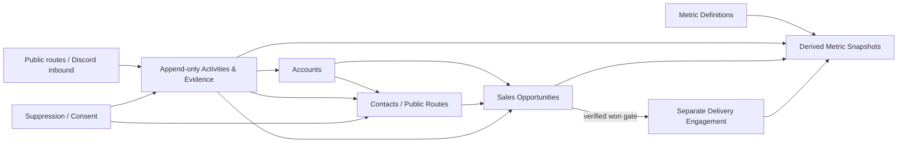

# Clause Services CRM KPI, Sales-Metric, and Methodology Design

**Status:** implementation-ready R&D design; no live CRM or integration changes
**Date:** 2026-07-30
**Canonical name used here:** Clause Services
**Naming caveat:** the supplied operating sources use `Claw Services` and `ClawServices`; the legal/brand name remains a founder decision.
**System state:** empty CRM; no imported leads, outreach, messages, Discord connection, or external CRM writes

## 1. Outcome and non-negotiable boundaries

This design extends the existing CRM foundation with a complete measurement and sales-operating layer while keeping the CRM empty until the founder explicitly authorizes activation.

The foundation remains:

- **Accounts** — organizations and relationship context.
- **Contacts / Public Routes** — people, roles, and observable business contact paths.
- **Opportunities** — the sales pipeline only.
- **Activities / Evidence** — append-only events and proof.
- **Suppression / Consent** — channel- and scope-specific contact controls.

The extension adds:

- versioned KPI definitions, targets, and dashboard views;
- source-grounded sales methodologies and stage evidence gates;
- Discord as an inbound and relationship channel;
- a separate delivery pipeline created only after a verified win;
- governance that prevents draft targets, activity volume, or public contact data from becoming implied permission or business truth.

### Existing decisions `[D]`

- Sales and delivery pipelines stay separate.
- Activities and evidence are append-only.
- Public contact information is not consent.
- Suppression takes precedence over contact eligibility.
- No stale lead queue, outreach, message, or external CRM write is authorized without founder approval.
- Discord may be represented as an inbound/relationship CRM channel, but it is not a separate system of record.

### Recommendations `[R]`

- Use a vendor-neutral schema and derived dashboards before choosing a CRM product.
- Start with an empty production dataset and synthetic fixtures in a separate test context.
- Display no more than eight executive KPIs at once; keep the complete registry available for diagnosis.
- Require evidence before every sales-stage transition.
- Keep real Discord logging manual and minimal until a separate connector/privacy decision is approved.

### Unknowns requiring founder decision `[U]`

- Canonical `Clause` versus `Claw` name.
- Accepted owners for revenue, sales operations, commercial control, and delivery.
- Commercial baselines and conversion targets.
- Which, if any, prospects may be activated.
- Whether a future Discord connector may read anything beyond manually selected messages or threads.

## 2. Source provenance and evidence status

### Canonical user-provided 10X corpus

- Canonical PDF: `/Users/ibrahimaftabodeen/Documents/Sales Coach Knowledge System/01_raw_sources/canonical/Grant Cardone 10X Business Summit Workbook - captured sequence.pdf`
- SHA-256: `6f2eff88cb5f5bf1f8c9ffb2ae2a844a2b3a209a6148170ddf71c30c2f3deba4`
- Coverage: five source batches, 106 captured PDF pages, printed workbook pages through 105, plus three unnumbered handwritten reverse sides.
- Completeness: Ibrahim confirmed on 2026-07-29 that the batches contain all nonblank instructional material. Printed pages 2 and 63 are absent from the physical sequence; page 106 onward contains intentionally omitted blank notes pages.

### Verified Obsidian retrieval layer

The promoted vault notes at:

`/Users/ibrahimaftabodeen/Desktop/Shmeeb Notes/Shmeeb/Projects/Sales Coach Knowledge System`

are verified mirrors of the canonical archive. The relevant modules are:

1. `Knowledge/01 Systems Targets and Marketing.md`
2. `Knowledge/02 Leads AI and Sales.md`
3. `Knowledge/03 Closing Follow-Up People Alignment.md`
4. `Knowledge/04 Hiring Culture and Scaling.md`
5. `Knowledge/05 P&L and Commitment.md`
6. `Sales Coaching Playbook.md`
7. `Sales Coach Source Corpus and Provenance.md`

The promotion report records 22 promotion checks, 87 archive checks, 58 semantic/citation checks, and 13 retrieval/boundary checks passing with no failures.

### Claw-specific synthesis

`/Users/ibrahimaftabodeen/Documents/Sales Coach Operations/team-guides/Claw_Services_Team_Sales_Plan_and_10X_Workbook_Guide_2026-07-29.md`

is a `draft-for-team-review`. Its formulas, owner assignments, thresholds, and operating templates are useful recommendations, not accepted founder commitments.

### Provenance labels used below

| Label | Meaning |
|---|---|
| `[D]` | Existing user-specified CRM or safety decision |
| `[S]` | Paraphrased concept supported by the supplied 10X corpus |
| `[R]` | Clause/Claw CRM implementation recommendation derived from the source and current constraints |
| `[U]` | Unknown or founder-set value; not inferred |

The Finder copy, if it becomes visible later, is supplemental. It does not override the canonical archive unless visual comparison establishes that it contains clearer or additional user-provided evidence.

## 3. CRM architecture and record model



### 3.1 Account

| Field | Rule |
|---|---|
| `account_id` | Opaque stable ID |
| `canonical_name` | Current operating name; aliases remain searchable |
| `aliases` | Includes spelling or `Claw/Clause` variants when relevant |
| `segment`, `territory` | Controlled values; may be `unknown` |
| `official_web_routes` | One or more dated, evidenced public routes |
| `relationship_origin` | `inbound`, `referral`, `public_research`, `existing_relationship`, or `unknown` |
| `account_owner_id` | One accountable owner or `unassigned` |
| `verification_status`, `verified_at` | Never inferred from an old lead list |
| `lifecycle_status` | `prospect`, `customer`, `former_customer`, `partner`, or `archived` |
| `created_from_activity_id` | Required for non-synthetic records |

### 3.2 Contact / Public Route

One record may represent a verified person, a public business route, or a Discord identity mapping. A route is not automatically a person.

| Field | Rule |
|---|---|
| `contact_route_id` | Opaque stable ID |
| `account_id` | Required unless the inbound identity is still under review |
| `record_kind` | `person`, `public_business_route`, `discord_user`, `discord_server`, `discord_channel`, or `discord_thread` |
| `display_name` | Observed value; not identity proof |
| `stable_external_id` | Provider ID where lawfully and deliberately captured |
| `role`, `decision_role_status` | `decision_participant`, `influencer`, `unknown`, etc. |
| `route_type` | `email`, `phone`, `web_form`, `discord_dm`, `discord_thread`, `other` |
| `source_ref`, `verified_at` | Required before any activation decision |
| `consent_resolution` | Derived from Suppression/Consent; defaults to `unknown` |
| `identity_confidence` | `unverified`, `partially_verified`, or `verified` |

### 3.3 Opportunity

An Opportunity represents a commercial decision process, not delivery work.

| Field | Rule |
|---|---|
| `opportunity_id` | Opaque stable ID |
| `account_id` | Required |
| `origin_channel` | Includes `discord`; does not imply consent |
| `source_activity_id` | Required |
| `sales_stage` | Derived from the latest valid stage-transition event |
| `owner_id` | One accountable owner |
| `problem`, `business_impact`, `timing_trigger` | Required by the qualification gate |
| `decision_participants` | Linked contacts with evidence |
| `resource_price_context` | May remain `unknown`; do not invent |
| `delivery_fit` | `unknown`, `fit`, `conditional`, or `not_fit` |
| `setup_value`, `monthly_recurring_value` | Separate values with currency and confidence |
| `next_action`, `next_action_due_at` | Required for every open opportunity |
| `lost_or_nurture_reason` | Required for the relevant terminal state |

### 3.4 Append-only Activity / Evidence

| Field | Rule |
|---|---|
| `activity_id` | Opaque stable ID and idempotency key |
| `occurred_at`, `recorded_at` | Store both; use `occurred_at` for business metrics |
| `actor_id` | Human, system, customer, or unknown |
| `channel` | Includes `discord`; provider-specific subtype is separate |
| `direction` | `inbound`, `outbound`, `internal`, or `system` |
| `activity_type` | Research, verification, approval, message, call, meeting, proposal, payment, stage transition, correction, etc. |
| `outcome_class` | Controlled classification; raw volume alone is not progress |
| `linked_record_refs` | Account/contact/opportunity/delivery IDs |
| `external_ref` | Stable provider reference or permalink when appropriate |
| `summary` | Minimal relationship-relevant paraphrase; avoid unnecessary private content |
| `evidence_ref`, `evidence_hash` | Proof pointer and integrity fingerprint |
| `approval_id` | Required for approval-gated outbound activity |
| `correction_of` | Corrections append a new event; prior evidence remains |

### 3.5 Suppression / Consent

| Field | Rule |
|---|---|
| `subject_ref` | Contact, route, account, or identity |
| `channel`, `scope` | Consent and suppression are channel- and purpose-specific |
| `status` | `unknown`, `consented`, or `suppressed` |
| `source_activity_id` | Required |
| `captured_at`, `expires_at` | Expiry may be absent |
| `evidence_ref` | Proof of the recorded status |
| `reason` | Opt-out, internal block, invalid route, legal restriction, etc. |

Resolution order is:

`suppressed > valid scoped consent > unknown`

An observable email address, phone number, website form, Discord username, server membership, public post, or prior conversation is **not** consent by itself.

### 3.6 Delivery Engagement

Delivery is a separate entity and pipeline linked back to the verified won opportunity.

Minimum delivery states are:

`intake → onboarding → implementation → quality_review → launched → optimization → steady_state → completed/cancelled`

A delivery state never changes sales-stage counts. Delivery events may affect retention, margin, capacity, outcome, and renewal metrics only.

### 3.7 Metric definitions and snapshots

```text
MetricDefinition
  metric_id
  name
  domain
  decision_supported
  formula
  numerator_definition
  denominator_definition
  entity_grain
  window
  timezone
  source_of_truth
  owner_role
  update_cadence
  provenance
  interpretation
  vanity_guardrail
  effective_from
  version

MetricTarget
  metric_id
  baseline_value
  target_value
  target_status
  approved_by
  effective_from
  effective_to
  rationale

MetricSnapshot
  metric_id
  metric_version
  window_start
  window_end
  value
  numerator
  denominator
  sample_size
  quality_status
  computed_at
```

Historical snapshots remain bound to the definition version that produced them. A formula change creates a new version; it does not silently rewrite prior decisions.

## 4. Discord inbound and relationship policy

Discord is a communication surface and evidence source. The CRM remains authoritative.

### Allowed design behavior `[D/R]`

- Manually link a relevant Discord identity, server, channel, or thread to an Account or Contact after identity review.
- Append a concise summary of a relevant inbound message, relationship event, referral, support request, or commercial question.
- Store stable provider IDs, timestamps, direction, a permalink/evidence pointer when appropriate, and the human reviewer.
- Classify an inbound event into a relationship or opportunity state without treating it as permission for unrelated outreach.

### Prohibited behavior without a separate approval `[D]`

- Importing server member lists.
- Bulk-reading or copying message history.
- Creating leads from public participation alone.
- Sending DMs, replies, invites, role changes, or automated messages.
- Treating a Discord username or public post as identity proof or consent.
- Keeping unnecessary full message bodies when a minimal summary and evidence pointer are sufficient.

### Inbound stage handling

An inbound Discord event may create an append-only Activity and an unlinked identity-review item. After review it may enter the sales pipeline at `responded`, with `origin_channel=discord`. This inbound exception does not backfill false `contacted` or `approved_to_contact` events. Any outbound next step still requires suppression resolution and the applicable founder approval.

## 5. Sales stages and required evidence

| Stage | Required evidence | Entry rule |
|---|---|---|
| `researched` | Account identity, source URL/ref, observed fact, research date | Research exists; no contact eligibility implied |
| `reverified` | Current operating status, current route, current fact, `verified_at`, owner, next action | Verification is current for the intended action; same-day reverification is required before approved outbound contact |
| `approved_to_contact` | Founder approval bound to exact account/contact, channel, and intended action; suppression cleared | Approval is not consent and expires if target/action changes |
| `contacted` | Provider delivery evidence, exact recipient/route, channel, timestamp, approved content reference | Attempted or draft messages do not count |
| `responded` | Inbound provider evidence and response classification | Unique respondent, not reply count |
| `discovery_scheduled` | Confirmed time, participant, owner, purpose | Proposed times do not count |
| `discovery_completed` | Attendance evidence and completed discovery note | Booking alone does not count |
| `qualified` | Relevant problem, impact, decision participant, timing/trigger, resource context, delivery fit, explicit next step | Every element present or explicitly marked with a disqualifying reason |
| `audit_demo` | Dated audit/demo evidence and buyer-facing result | Internal preparation alone does not count |
| `proposal_sent` | Versioned scope, setup/recurring price, terms, exclusions, acceptance criteria, decision date, delivery evidence | A draft is not a sent proposal |
| `decision_pending` | Buyer-confirmed decision step and date | Seller-created follow-up date alone is insufficient |
| `won` | Signed scope, setup cash collected, recurring billing active, starting baseline, 90-day plan, and available delivery capacity | Creates a separate Delivery Engagement |
| `lost` | Dated decision and normalized plus verbatim loss reason where appropriate | Do not infer loss from silence without the defined close-out rule |
| `nurture` | Reason, lawful relationship basis, owner, and review date | No automatic sequence is authorized |
| `do_not_contact` | Suppression event and reason | Terminal for outbound eligibility unless an authorized status change is evidenced |

Stage transitions are Activities/Evidence events. Invalid or unsupported transitions are rejected. A correction appends a superseding event with an explanation.

## 6. Source-grounded sales methodology layer

No extended workbook text is reproduced. The entries below paraphrase only the supplied source and distinguish source concepts from CRM implementation.

| Method | 10X-supported concept `[S]` | CRM implementation `[R]` | Provenance |
|---|---|---|---|
| Systems audit | Diagnose targets, KPI tracking, marketing, lead generation, sales, people, leadership, and AI before scaling | Score each system 1–5 with evidence, owner, constraint, next action, and review date; ratings are diagnostic, not performance claims | B001 PDF p007–p008 / workbook p8–p9 |
| Build, optimize, scale | Establish the system, improve it, then scale it | Do not add lead volume or automation before stage evidence, data quality, conversion, and delivery capacity are stable | B001 PDF p018 / workbook p19 |
| Explicit targets | Track revenue, profit, leads, sales capacity, enterprise value, and personal/financial outcomes | Every target gets a baseline, owner, definition, source, leading/lagging measure, deadline, and approved status | B001 PDF p012–p019 / workbook p13–p20 |
| Attention measurement | Measure activity, reach, engagement, response, media efficiency, acquisition economics, return, and value | Map every demand metric to one funnel stage and prevent double-counting embedded stages | B001 PDF p020–p024 / workbook p21–p25 |
| Problem-oriented offer | Attention becomes a lead through an offer intended to solve a problem | Record source, audience, problem, offer, route, cost, volume, conversion, and owner; awareness alone is not a lead | B002 PDF p001–p006 / workbook p26–p31 |
| Database discipline | Treat the customer database, nurture, reactivation, and CRM utilization as operating systems | Require owner, state, next action, source freshness, response classification, and suppression resolution | B002 PDF p007–p015 / workbook p32–p40 |
| Opportunity inventory | Inventory opportunity types and define process, people, script, measurement, and management | Maintain a channel/source register; enable only founder-approved sources | B002 PDF p017–p022 / workbook p42–p47 |
| Defined and rehearsed process | Use a multi-stage process and rehearse it | Train against the evidence-gated CRM stages and score recordkeeping as part of rehearsal | B002 PDF p019–p020 / workbook p44–p45 |
| Qualification | Ask sufficiently deep, open questions; listen; establish importance, desired outcome, and decision mechanics | Use the qualification evidence gate; do not promote based on enthusiasm or a booked call | B002 PDF p023–p024 / workbook p48–p49; B003 PDF p001 / workbook p50 |
| Proposal discipline | Write the proposal, ask for a decision, and avoid relying on assumptions | Use a proposal checklist with scope, dependencies, limits, prices, acceptance evidence, and decision date | B003 PDF p002–p009 / workbook p51–p58 |
| Objection diagnosis | Prepare for recurring barriers and distinguish a real blocker from a complaint or question | Log exact language, stage, type, evidence needed, response hypothesis, next ask, and result; retain an open “something else” path | B003 PDF p004–p008 / workbook p53–p57 |
| Follow-up experiment | Use multiple follow-up methods and track outcomes across attempts | Test only short, manually approved sequences; measure attempt bucket and result without adopting handwritten contact-count percentages as targets | B003 PDF p010–p014 / workbook p59–p62 |
| Training | Use recurring rehearsal, role play, review, testing, and correction | Weekly role-play scorecard covers fact-finding, listening, scope/price, decision ask, objection diagnosis, next step, and record accuracy | B003 PDF p015 / workbook p64 |
| Evidence-based accountability | Track operating activity and report important work frequently | Review controllable execution, conversion, strategy, capacity, and measurement failures separately | B004 PDF p009–p010 / workbook p81–p82 |
| Scaling constraints | Assess strategy, marketing, sales, people, operations, finance, leadership, data, technology, and investment thesis | Maintain a constraint register; do not treat additional selling as the remedy for every bottleneck | B004 PDF p018–p024 / workbook p89–p95 |
| PPF / Four P’s / Four M’s | Connect personal, professional, and financial goals with Promote, Profit, Process, People and Model, Mimic, Master, Multiply | Use as a planning lens only; blank attendee fields and unsupported completions are not CRM requirements | B005 PDF p001–p003 / workbook p96–p98 |
| P&L commitment | Model growth against income, offers, people, advertising, customers, time, and money | Tie growth experiments to unit economics, capacity, explicit assumptions, guardrails, and stop rules | B005 PDF p004–p009 / workbook p99–p104 |

Workbook percentages, market statistics, revenue breakpoints, causal claims, attendee-entered follow-up percentages, and historical tool descriptions are not Clause targets or verified external facts.

## 7. Metric quality contract

Every active metric must specify:

1. the decision it changes;
2. formula and entity grain;
3. numerator and denominator where applicable;
4. event-time window and `America/New_York` reporting timezone;
5. source of truth;
6. one accountable owner;
7. update and review cadence;
8. definition version and provenance;
9. interpretation and quality limitations;
10. the paired downstream or guardrail metric that prevents vanity optimization.

### Counting rules

- Use half-open windows: `[window_start, window_end)`.
- Use `occurred_at`, not data-entry time, for business outcomes.
- Count distinct Accounts, Contacts, Opportunities, or Customers as defined; do not count Activity rows when the metric is entity-based.
- Deduplicate provider retries and corrected events with `activity_id`/idempotency keys.
- A rate with a zero or unknown denominator is `UNKNOWN`, never `0%`.
- Show numerator, denominator, and sample size beside every rate.
- Mark samples below ten as `directional-small-sample`; do not hide the counts.
- Do not compare provider metrics whose definitions differ without a visible compatibility note.
- Do not infer attribution or causation from temporal correlation.
- Draft, queued, attempted, or internally prepared work does not count as delivered external activity.

## 8. Complete metric registry

Owner names below are proposed:

- **Revenue owner:** Ibrahim, pending acceptance.
- **Sales Ops:** Shane, pending acceptance.
- **Commercial/Delivery:** Javed, pending acceptance.
- **CRM steward:** founder-appointed; currently unknown.

All commercial baselines and outcome targets are `[U]` until measured and approved.

### 8.1 Demand and attention metrics

These definitions are `[S/R]` from the workbook’s KPI ladder. They remain `dormant` until a lawful, reliable source exists.

| Metric | Calculation | Proposed owner / cadence | Source of truth | Interpretation and vanity safeguard |
|---|---|---|---|---|
| Published frequency | Distinct externally published items in window | Sales Ops / weekly | Provider publication history | Activity only; never green without downstream response or lead evidence |
| Impressions | Provider-reported displays | Sales Ops / weekly | Channel provider | Not unique people and not demand by itself |
| Qualified views | Provider-defined views | Sales Ops / weekly | Channel provider | Store provider definition; do not compare incompatible platforms |
| Engagement actions | Distinct attributable likes, comments, saves, or replies | Sales Ops / weekly | Channel provider | Show by action type and pair with qualified attention or leads |
| Open rate | Unique opens / delivered unique recipients | Sales Ops / per campaign | Delivery provider | Privacy-inflated opens flagged; no denominator means `UNKNOWN` |
| Click rate | Unique clickers / delivered unique recipients | Sales Ops / per campaign | Delivery provider | Total clicks cannot be mixed with unique recipients |
| CPM | Attributable media cost / impressions × 1,000 | Commercial / per campaign | Spend ledger + provider | Cost efficiency, not business outcome |
| CPC | Attributable media cost / valid clicks | Commercial / per campaign | Spend ledger + provider | Exclude known invalid/duplicate clicks where provider supports it |
| CPL | Attributable campaign cost / net-new defined leads | Commercial / per campaign | Spend ledger + CRM | “Lead” must meet the active definition; do not double-count an opt-in already embedded in CPL |
| CPA | Attributable cost / completed defined action | Commercial / per campaign | Spend ledger + CRM | The action must be named in the metric version |
| CAC | Attributable sales and marketing cost / net-new customers | Commercial / monthly | Spend/labor ledger + CRM | Include material labor and channel cost; pair with contribution/LTV |
| ROAS | Attributable revenue / ad spend | Commercial / monthly | Payment ledger + spend ledger | Attribution model visible; correlation is not proof |
| LTV | Approved contribution-based customer-value model | Commercial / monthly/quarterly | Contracts, payments, costs, churn | `UNKNOWN` until margin and retention assumptions are stable |

### 8.2 Sales metrics

| Metric | Calculation | Proposed owner / cadence | Source of truth | Interpretation and safeguard |
|---|---|---|---|---|
| Reverified prospects | Distinct Accounts entering `reverified` in window | Sales Ops / daily-weekly | Stage events + verification evidence | Controllable preparation; does not imply contact permission |
| Approved personalized touches | Distinct reverified Accounts with a delivered, approval-bound first contact | Sales Ops / daily-weekly | Approval + provider evidence | Dormant while lead activation is `NO`; attempts without delivery do not count |
| Positive responses | Distinct respondents classified relevant/positive | Sales Ops / daily-weekly | Inbound evidence + classification | Count people/accounts per declared grain, not messages |
| Qualified opportunities created | Distinct Opportunities entering `qualified` | Revenue owner / weekly | Qualification transition evidence | Primary pipeline creation measure; requires the full qualification gate |
| Discovery calls completed | Distinct attended discoveries with complete note | Revenue owner / weekly | Calendar/call evidence + discovery record | Booking is not completion |
| Proposals issued | Distinct qualified Opportunities entering `proposal_sent` | Revenue owner / weekly | Proposal version + delivery evidence | Drafts and duplicate sends do not count |
| Paid design partners / wins | Distinct Opportunities entering `won` | Revenue owner / weekly-monthly | Signed scope + payment + billing evidence | A verbal yes is insufficient |
| Response rate | Unique respondents / delivered unique recipients | Sales Ops / weekly | Provider evidence + CRM | Consistent unique denominator |
| Positive-response rate | Positive unique respondents / delivered unique recipients | Sales Ops / weekly | Provider evidence + classification | Report count and sample size |
| Show rate | Attended qualified discoveries / booked qualified discoveries | Revenue owner / weekly | Calendar/call evidence | Reschedules/cancellations classified separately |
| Discovery-to-opportunity rate | Newly qualified Opportunities / completed discoveries | Revenue owner / weekly-monthly | Discovery and stage events | Diagnose qualification/fit, not seller effort alone |
| Proposal rate | Proposals issued / completed qualified discoveries | Revenue owner / weekly-monthly | Stage events | Unexpectedly high rate may indicate weak qualification |
| Stage conversion | Distinct Opportunities entering next stage / eligible Opportunities in current stage | CRM steward / weekly | Stage ledger | Define cohort/window; do not divide unrelated period totals |
| Win rate | Closed-won / closed decided Opportunities | Revenue owner / monthly | Terminal stage events | Open pipeline excluded; small samples remain directional |
| Average deal value | Total closed-won contract value / closed-won deals | Commercial / monthly | Signed contracts | Show setup and recurring components separately |
| Sales-cycle time | Mean and median time from `qualified` to decided terminal state | Revenue owner / monthly | Stage events | Show median and sample size to expose outliers |
| Stage age | Current time − latest valid stage-entry time | Sales Ops / daily | Stage ledger | Operational queue metric; display by stage and owner |
| Pipeline coverage | Qualified/weighted open pipeline / remaining approved revenue goal | Revenue owner / weekly | Opportunities + approved target | `UNKNOWN` while revenue goal or weights are unapproved |
| Sales velocity | Qualified Opportunities × win rate × average deal value / average sales-cycle days | Revenue owner / monthly | Derived from CRM | Diagnostic composite only; suppress until components have adequate data |

### 8.3 Revenue and economics metrics

| Metric | Calculation | Proposed owner / cadence | Source of truth | Interpretation and safeguard |
|---|---|---|---|---|
| Setup cash collected | Cash received for setup work in window | Commercial / weekly-monthly | Payment ledger | Cash received, not invoiced |
| MRR | Active recurring monthly contract value at cutoff | Commercial / monthly | Active contracts/billing | Exclude setup and inactive agreements |
| Average recurring value | Active MRR / active recurring customers | Commercial / monthly | Contracts/billing | Show customer count and distribution |
| Gross margin | (Revenue − direct fulfillment cost) / revenue | Commercial / monthly | Payments + cost ledger | Cost categories versioned; zero revenue gives `UNKNOWN` |
| Contribution after founder labor | Revenue − direct costs − stated founder-labor cost | Commercial / monthly | Payments, costs, time assumption | Founder labor assumption must be visible |
| Logo churn | Customers lost / customers active at period start | Commercial / monthly/quarterly | Customer lifecycle events | New customers are not in denominator |
| Revenue churn | Recurring revenue lost / recurring revenue at period start | Commercial / monthly | Billing events | Expansion reported separately |
| Net revenue retention | (Starting recurring revenue − churn − contraction + expansion) / starting recurring revenue | Commercial / monthly/quarterly | Billing events | `UNKNOWN` with no starting recurring base |

### 8.4 Delivery and customer metrics

These appear only in the separate delivery panel.

| Metric | Calculation | Proposed owner / cadence | Source of truth | Interpretation and safeguard |
|---|---|---|---|---|
| Onboarding completion | Engagements meeting all onboarding evidence / engagements due | Delivery / weekly | Delivery events | Checklist completion, not subjective status |
| Time to first value | Median time from verified win/onboarding start to first evidenced customer value | Delivery / weekly-monthly | Delivery and outcome evidence | “Value” definition is offer-specific and approved |
| Launch cycle time | Median time from delivery intake to verified launch | Delivery / monthly | Delivery stage events | Blocked time also shown |
| Support hours per client | Attributable support hours / active clients | Delivery / weekly-monthly | Time/activity records | State time-capture limitations |
| Rework/defect rate | Delivery items requiring correction / reviewed delivery items | Delivery / weekly-monthly | QA events | Define correction threshold; customer change requests separate |
| Blocked accounts | Count of active engagements in `blocked` condition | Delivery / daily-weekly | Delivery events | Show blocker, owner, and age |
| Verified customer outcomes | Engagements with offer-specific outcome evidence | Delivery / monthly | Customer-approved evidence | Testimonials or satisfaction alone do not substitute |
| Renewal rate | Renewed eligible accounts / renewal-eligible accounts | Commercial/Delivery / monthly-quarterly | Contract events | Show eligible count |
| Referral count | Distinct evidenced referrals in window | Revenue owner / monthly | Inbound relationship events | Do not infer referral from name mentions |

### 8.5 Data-quality and governance metrics

| Metric | Calculation | Proposed owner / cadence | Source of truth | Interpretation and safeguard |
|---|---|---|---|---|
| Active-record completeness | Complete active Opportunities / active Opportunities | CRM steward / daily-weekly | CRM validation | Required fields are versioned by stage |
| Stage-evidence completeness | Evidence-valid transitions / all transitions | CRM steward / daily-weekly | Stage ledger | Recommended control target: 100% |
| Owner completeness | Open Opportunities with owner / open Opportunities | Sales Ops / daily | CRM | Recommended control target: 100% |
| Next-step completeness | Open Opportunities with dated next action / open Opportunities | Sales Ops / daily | CRM | Recommended control target: 100% |
| Overdue next actions | Open next actions past due | Sales Ops / daily | CRM task state | Show count, owner, and age; not a conversion metric |
| Unclassified inbound events | Inbound relationship events lacking classification | Sales Ops / daily | Activity ledger | Queue health metric |
| Invalid routes | Routes evidenced invalid / routes reviewed | Sales Ops / weekly | Verification events | Invalid route may trigger route suppression |
| Stale verification | Contact-eligible records lacking current verification for intended action | Sales Ops / daily before activation | Verification events | Same-day reverification required for approved outbound |
| Suppression violations | Outbound events executed while resolved status was suppressed | Founder/CRM steward / immediate-weekly | Consent + Activity ledger | Recommended control target: zero; any occurrence is an incident |

### 8.6 Discord relationship metrics

These are `[R]`, not direct workbook metrics. They operationalize the source-supported channel, database, opportunity, and outcome discipline.

| Metric | Calculation | Proposed owner / cadence | Source of truth | Interpretation and safeguard |
|---|---|---|---|---|
| Relevant inbound Discord events | Distinct manually reviewed inbound events in window | Sales Ops / weekly | Activity ledger | Relationship workload, not lead volume |
| Discord linkage completeness | Reviewed relevant events linked to Account/Contact or explicitly unresolved / reviewed relevant events | CRM steward / weekly | Activity ledger | Prevent orphan evidence; no member-list denominator |
| Qualified opportunities from Discord | Opportunities entering `qualified` with `origin_channel=discord` | Revenue owner / weekly-monthly | Stage ledger | Business outcome count, not message count |
| Discord logging completeness | Relevant logged events with timestamp, direction, reviewer, summary, and evidence ref / relevant logged events | CRM steward / weekly | Activity validation | Full content is neither required nor preferred |

## 9. Minimum dashboard

### 9.1 Executive scorecard — maximum eight

1. Qualified opportunities created
2. Completed qualified discoveries
3. Proposals issued
4. Paid design partners / verified wins
5. Setup cash collected
6. MRR
7. Active-record plus stage-evidence completeness
8. Stage aging and overdue next actions

Each tile shows:

- actual count/value;
- approved baseline and target, or `UNKNOWN / FOUNDER-SET`;
- current window and prior comparable window;
- owner;
- source freshness and quality status;
- numerator/denominator for rates;
- the next decision the measure supports.

### 9.2 Sales funnel

- current count by stage;
- cohort conversion between defined adjacent stages;
- median and maximum age by stage;
- next-step completeness;
- source/channel and owner filters;
- normalized loss/nurture reasons;
- counts beside every percentage.

### 9.3 Governance panel

- missing owners, evidence, and next actions;
- stale verification;
- unclassified inbound events;
- invalid routes;
- suppression violations;
- unapproved metric definitions or targets.

### 9.4 Separate delivery panel

- onboarding completion;
- time to first value;
- launch cycle;
- gross margin and contribution;
- support load;
- rework;
- blockers/capacity;
- verified outcomes, renewals, and referrals.

### 9.5 Empty-state behavior

The initial dashboard must say:

- `No active CRM records`
- `Commercial baselines: UNKNOWN`
- `Lead activation: NOT AUTHORIZED`
- `No rate is calculable`

It must not display false zeros, green status, fabricated targets, or progress inferred from documents and product work.

## 10. Governance and anti-vanity safeguards

### Metric activation

1. CRM steward proposes the definition and source.
2. Owner validates that the metric changes a real decision.
3. Founder approves activation and any target.
4. The definition receives an effective date and version.
5. Historical dashboards retain their original definition version.

### Target governance

- Commercial targets are `UNKNOWN / FOUNDER-SET` until a measured baseline exists.
- A target change requires approver, date, previous value, new value, and reason.
- Workbook claims, attendee handwriting, draft forecasts, or motivational multiples cannot populate targets.
- Missing execution data is diagnosed before changing strategy or increasing lead volume.

### Vanity-metric rules

- Attention metrics cannot make the executive dashboard green without a paired downstream response, qualified-opportunity, customer, or economics measure.
- Activity volume never substitutes for delivered evidence or stage progress.
- Product or delivery work never counts as sales-pipeline progress.
- Rates always show counts and denominator.
- Small samples are visibly labeled.
- Cost metrics include known material costs and disclose exclusions.
- Composite metrics are hidden until their inputs are defined and sufficiently populated.
- A later-attempt outcome does not prove that attempt number caused the outcome.

### Access and privacy

- Store only the minimum relationship evidence needed for the decision and audit.
- Prefer Discord summaries and stable evidence references over copied private conversations.
- Separate private fields from general team reporting.
- A suppression record is visible to every action gate that could enable contact.
- No system may translate public availability into contact permission.

## 11. Empty-CRM implementation sequence

1. **Founder decision gate** — resolve or explicitly defer the name, owners, KPI shortlist, cadence, Discord policy, and lead activation.
2. **Create the empty schema** — Accounts, Contacts/Public Routes, Opportunities, Activities/Evidence, Suppression/Consent, Delivery Engagements, Metric Definitions, Targets, and Snapshots.
3. **Install controlled vocabularies and validators** — stages, outcomes, directions, channels, evidence requirements, and consent resolution.
4. **Implement append-only state derivation** — current opportunity/delivery state comes from validated events; corrections are new events.
5. **Implement suppression-first eligibility checks** — blocked or unknown states cannot be silently upgraded.
6. **Install the source and metric registries** — keep source provenance separate from live business facts.
7. **Build empty-state dashboards** — verify `UNKNOWN`, not zero, and keep sales/delivery panels separate.
8. **Run synthetic-only fixtures** — validate stage gates, deduplication, rates, corrections, Discord inbound mapping, and won-to-delivery handoff outside production.
9. **Operate Discord manually/read-only** — no connector, member import, bulk history, or outbound action.
10. **Founder acceptance review** — inspect schemas, evidence gates, dashboard calculations, access, and privacy.
11. **Optional real-record activation** — only after an explicit founder decision. Reverify every selected prospect against current sources and add individually or through a separately approved controlled import. Do not import stale queues by default.
12. **Optional outbound pilot** — requires a separate approval for each exact recipient, channel, and final message, plus readback verification and suppression clearance.

## 12. Acceptance tests

| ID | Scenario | Required result |
|---|---|---|
| CRM-01 | Empty production CRM | No records; commercial metrics and rates show `UNKNOWN` |
| CRM-02 | Public email/phone/web form is recorded | Consent remains `unknown` |
| CRM-03 | Public Discord post or server membership is observed | No lead, consent, or DM eligibility is created |
| CRM-04 | Relevant inbound Discord message is manually logged | Append-only evidence is created; outbound remains gated |
| CRM-05 | Suppressed route is selected for contact | Eligibility fails closed and incident evidence is recorded if execution was attempted |
| CRM-06 | Stage transition lacks required evidence | Transition is rejected |
| CRM-07 | Evidence correction is needed | New correction event supersedes; original remains |
| CRM-08 | Duplicate provider event arrives | Idempotency prevents double counting |
| CRM-09 | Booked discovery is cancelled | It does not count as completed |
| CRM-10 | Proposal draft exists but was not delivered | It does not count as issued |
| CRM-11 | Verbal acceptance exists without payment/billing | Opportunity does not enter `won` |
| CRM-12 | Verified win satisfies every gate | Separate Delivery Engagement is created; sales history stays unchanged |
| CRM-13 | Denominator is zero or unknown | Rate is `UNKNOWN`, never `0%` |
| CRM-14 | Sample size is below ten | Counts display with `directional-small-sample` |
| CRM-15 | Formula or target changes | New version is created; prior snapshots remain reproducible |
| CRM-16 | Product/delivery activity increases | Sales progress remains unchanged unless sales-stage evidence exists |
| CRM-17 | Workbook percentage is entered as a target | Validation/review rejects it unless the founder independently approves it as a founder-set target |
| CRM-18 | Sales stage is won and delivery later blocks | Delivery dashboard changes; win count and sales-stage history do not |
| CRM-19 | Stale queue is offered for bulk import | Import remains disabled without explicit founder approval |
| CRM-20 | No account or connector is configured | All design and synthetic tests still pass without external writes |

## 13. Founder decision card

| Decision | Recommended default | Current status |
|---|---|---|
| Executive KPI shortlist | Qualified opportunities, completed discoveries, proposals, paid design partners, setup cash, MRR, evidence/data completeness, stage aging/overdue actions | `[R]` pending approval |
| Commercial baselines | Measure first; display `UNKNOWN` | `[U]` |
| Commercial targets | Founder-set after a clean 14-day approved measurement period; no workbook-derived conversion target | `[U]` |
| Control standards | 100% active records with owner, next action, and required stage evidence; zero suppression violations | `[R]` pending approval |
| Revenue/closing owner | Ibrahim | `[R]` pending acceptance |
| Sales-operations owner | Shane | `[R]` pending acceptance |
| Commercial/delivery owner | Javed | `[R]` pending acceptance |
| CRM/metric steward | Founder-appointed owner | `[U]` |
| Dashboard cadence | Daily hygiene queue; weekly founder sales review; monthly economics and delivery review | `[R]` pending approval |
| Discord logging | Manual, inbound/relationship-relevant summaries only; no member/history import; public activity is not consent; outbound requires exact approval | `[R]` |
| Lead activation | **NO** — activate none until explicit founder approval | `[D]` current default |
| Canonical business name | Use `Clause Services` in this artifact; retain `Claw Services/ClawServices` as source aliases | `[U]` final decision needed |

## 14. Current terminal state

- The design layer is complete.
- The source corpus and Obsidian notes were used read-only.
- No live CRM exists or was connected.
- No Accounts, Contacts, Opportunities, Activities, consent records, Discord records, or delivery records were created.
- No stale queue was imported.
- No outreach or message was drafted or sent.
- No external system was changed.
- The next authorized step is founder review of the decision card, not lead activation.
