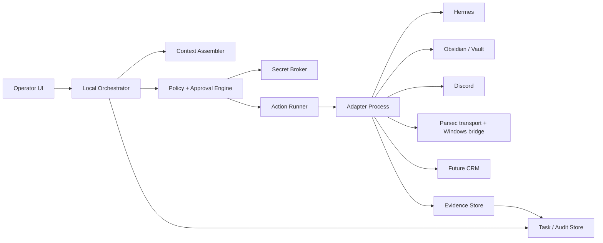

# Claw Services Operator Console

**Status:** implementation-ready architecture proposal
**Date:** 2026-07-30
**Scope:** local-first orchestration for AI-assisted work across Hermes, an Obsidian/local vault, Discord, Parsec/Windows, and a future vendor-neutral CRM
**Non-goals for this design task:** no product or operational data was changed; no message was sent; no CRM record was created; no external service was connected.

## 1. Outcome

Build the Operator Console as a **local control plane around small, deterministic adapter actions**, not as one agent with an ever-growing conversation and direct access to every app.

The console persists a compact task card, loads only the compartment needed for the next step, resolves exactly one current target, checks policy, performs at most one effectful action, verifies the result independently, and appends the observed state delta to an audit log. Cross-device continuation uses a redacted handoff packet whose stable identifiers and evidence fingerprints are more important than screen coordinates.

The recommended first implementation is a single local service with:

- a SQLite state and audit store;
- an orchestrator expressed as a durable state machine;
- a policy/approval engine that is the only route to effectful adapter calls;
- process-isolated adapters with capability discovery;
- an encrypted secret broker that returns short-lived handles, never credentials to the task context;
- a small operator UI showing the task card, verification evidence, pending approval, and recovery choices.

This is a modular monolith initially. Split services only when deployment or isolation evidence requires it.

## 2. Evidence and known facts

### 2.1 Claw-specific facts

- The supplied `Claw Services` project workspace contains no strategy, runbook, vault, product, or operational files. It contains only Git metadata.
- A read-only search outside the project found two relevant strategy sources:
  - [`Claw_Services_Team_Sales_Plan_and_10X_Workbook_Guide_2026-07-29.md`](</Users/ibrahimaftabodeen/Documents/Sales Coach Operations/team-guides/Claw_Services_Team_Sales_Plan_and_10X_Workbook_Guide_2026-07-29.md>), SHA-256 `b8ebfb85...b296a2f5`, whose evidence cutoff is 2026-07-29;
  - [`01_clawservices_current_context.md`](/Users/ibrahimaftabodeen/Documents/clawservices_agent_knowledge_files/01_clawservices_current_context.md), SHA-256 `8e8841f4...91f34e5`, last modified 2026-04-29.
- The 2026-07-29 plan explicitly labels itself `draft-for-team-review`; its roles and targets are proposals, not accepted commitments. It names Ibrahim as owner and final decision authority.
- That draft requires one central prospect ledger with explicit metric definitions and sources, prohibits mass or unsupervised outreach, and says no external message should be sent until Ibrahim approves the exact recipient, channel, and final text.
- The older current-context file describes ClawServices as an early-stage digital services and AI automation business. Because it predates the 2026-07-29 plan, it is supporting background rather than authority for current workflow state.
- **Claw Services** is the canonical company name used throughout this proposal. Existing filenames or system identifiers that use `ClawServices` remain unchanged.
- “Hermes” is not identified by product, version, protocol, or ownership in the available material. Its adapter is therefore specified as a capability-negotiating port, with its concrete transport left as a validation item.

**Recommendations derived from the Claw sources:**

- Preserve each source’s status (`approved`, `draft`, `proposed`, `observed`, `unknown`) and date when assembling operating context; never flatten draft targets into active permissions.
- Seed the policy engine with external messaging disabled unless an exact founder approval is bound to recipient, channel, and final content. Keep mass and unsupervised outreach disabled.
- Keep CRM imports disabled during the prototype. Use the draft’s ledger fields as the initial vendor-neutral CRM schema, but test them only with synthetic records until separately approved.
- Make source and verification date first-class fields so the console cannot turn an old candidate, UI observation, or estimate into a current fact.

### 2.2 External facts and their design implications

- **Fact:** NIST’s zero-trust architecture separates policy decisions from policy enforcement and says access should be limited to the least privileges needed for a task, using observable state as policy input. [NIST SP 800-207](https://doi.org/10.6028/NIST.SP.800-207)
  **Recommendation derived from it:** put a central policy gate in front of every effectful adapter operation.
- **Fact:** HTTP defines idempotency by intended effect and advises against automatically retrying non-idempotent requests unless the client knows the operation is idempotent or can determine that the original was not applied. [RFC 9110 §9.2.2](https://www.rfc-editor.org/rfc/rfc9110.html#section-9.2.2)
  **Recommendation derived from it:** use an explicit `UNKNOWN_OUTCOME` state after an inconclusive timeout.
- **Fact:** an Obsidian vault is a folder tree. Obsidian’s developer guidance distinguishes cached reads from current reads and warns against overwriting a file changed by another process. [Obsidian Vault API](https://docs.obsidian.md/Plugins/Vault)
  **Recommendation derived from it:** use filesystem-native access plus content-hash compare-and-swap for writes.
- **Fact:** Discord uses a stateful Gateway for events and an HTTP API for most resource operations. Intents restrict which event classes and message content an app receives, and API clients must honor rate limits. [Discord Gateway](https://docs.discord.com/developers/events/gateway), [Discord API reference](https://docs.discord.com/developers/reference)
  **Recommendation derived from it:** use least-privilege scopes, persist a cursor/checkpoint, and prefer a rate-limit-aware connector to screen driving where an approved API connection exists.
- **Fact:** Parsec supplies a remote desktop session, with Windows among its supported hosts; guest keyboard and mouse permissions are separately controlled. [Parsec compatibility](https://support.parsec.app/hc/en-us/articles/32381568346644-Hardware-and-Software-Compatibility), [Parsec hosting and permissions](https://support.parsec.app/hc/en-us/articles/32381747079572-Hosting-and-Permissions)
  **Recommendation derived from it:** treat Parsec as remote-session transport, not as a source of stable application selectors.
- **Fact:** Microsoft UI Automation exposes desktop UI elements programmatically to clients and can be used by automated test scripts. [Microsoft UI Automation](https://learn.microsoft.com/en-us/uwp/api/windows.ui.uiautomation)
  **Recommendation derived from it:** use semantic Windows selectors as the primary target mechanism.
- **Fact:** NIST describes log management as the generation, transmission, storage, access, and disposal of event records for operational and security uses. OpenTelemetry defines a vendor-neutral log model with timestamps, severity, resource, trace, and span identifiers. [NIST SP 800-92](https://doi.org/10.6028/NIST.SP.800-92), [OpenTelemetry log data model](https://opentelemetry.io/docs/specs/otel/logs/data-model/)
  **Recommendation derived from it:** use structured, correlated audit records while leaving the log backend replaceable.

Everything from section 3 onward is a **recommendation**, unless explicitly labeled as a fact.

## 3. Architecture and trust boundaries



### 3.1 Responsibilities

| Component | Owns | Must not own |
|---|---|---|
| Operator UI | task card, evidence preview, approval/recovery controls | credentials, direct adapter writes |
| Orchestrator | action-loop state machine, task lease, retries, handoffs | vendor-specific selectors or tokens |
| Context assembler | compartment selection, redaction, token/size budgets | credential material |
| Policy/approval engine | allow/deny/require-approval decision, approval binding | executing the action |
| Secret broker | encrypted credentials and short-lived capability handles | task goals or UI screenshots |
| Action runner | one authorized action attempt and timeout accounting | choosing business intent |
| Adapter | app discovery, inspection, target resolution, action, verification, recovery | global policy or cross-app memory |
| State/audit store | task cards, handoffs, append-only events, evidence pointers | plaintext secrets |

### 3.2 Recommended deployment

Run the orchestrator, policy engine, and SQLite store on the operator’s trusted primary device. Run each adapter in a separate process with an allowlist of resources and methods. Put the Windows UI Automation bridge on the Windows host, reachable only through an authenticated local/overlay channel; Parsec remains the human-visible transport rather than the command protocol.

Use one writer lease per task and one action lease per target. This prevents two devices from continuing the same handoff simultaneously. A lease expiration permits takeover only after a fresh inspection.

### 3.3 Replaceable reference stack

- TypeScript for the orchestrator, policy contracts, local adapters, JSON Schema validation, and the operator UI backend;
- SQLite for transactional local state, with a content-addressed encrypted directory for evidence;
- versioned JSON-RPC over Unix domain sockets or named pipes between the orchestrator and local adapter processes;
- C#/.NET for the constrained Windows UI Automation bridge;
- the host OS credential store behind a `SecretBroker` interface;
- a local web UI bound to loopback, with platform authentication before any approval action.

These are implementation defaults, not interface requirements. The adapter protocol, handoff schema, audit event model, and policy decision contract must remain language- and vendor-neutral.

## 4. Persistent task card

The task card is the complete resume surface, but not the complete history. Keep it under roughly 2 KiB serialized; point to evidence rather than embedding screenshots, private text, or transcripts.

| Required field | Recommended representation and rule |
|---|---|
| Goal | one outcome sentence plus explicit done condition |
| Active app/device | adapter ID, app instance, device ID, session ID |
| Current verified state | short claim, verification timestamp, evidence pointer, state fingerprint |
| Target control | semantic locator plus expected role/name/state; no bare coordinates |
| Last action/result | action type, action ID, observed outcome, state delta |
| Next action | exactly one proposed action and expected postcondition |
| Constraints | scope, prohibited effects, time/data boundaries |
| Approval requirement | `none`, `required`, `approved`, `denied`, or `expired`; policy reason and approval ID |
| Source of truth | typed resource reference, version/revision, and authoritative adapter |

```yaml
task_id: task_01J...
revision: 17
goal:
  summary: "Prepare a verified draft response; do not send it."
  done_when: "Draft exists locally and matches the cited Discord thread."
active_surface:
  adapter: discord
  device_id: mac-primary
  app_instance: discord-api:workspace-1
  session_id: sess_01J...
verified_state:
  claim: "Thread 123 latest visible message is message 789."
  observed_at: "2026-07-30T15:12:04Z"
  freshness_ms: 30000
  fingerprint: "sha256:..."
  evidence_ref: evidence_01J...
target:
  resource_ref: "discord://guild/456/channel/123/thread/123"
  semantic_locator: {kind: message, id: "789"}
  expected: {exists: true}
last:
  action_id: action_01J...
  action: inspect
  result: verified
  delta: "latest_message_id: 788 -> 789"
next:
  action: "create_local_draft"
  expected_postcondition: "draft hash equals rendered proposal hash"
constraints:
  - "No external messages"
  - "No operational record mutation"
approval:
  status: none
  policy_reason: "local draft only"
source_of_truth:
  adapter: discord
  resource_ref: "discord://guild/456/channel/123/thread/123"
  version: "latest_message_id:789"
updated_at: "2026-07-30T15:12:04Z"
```

Update the card with optimistic concurrency: `UPDATE ... WHERE revision = expected_revision`. On conflict, stop, reload, and re-inspect. Never merge two independently advanced task cards.

## 5. Context compartments

Each compartment has a separate schema, storage policy, and injection rule. The context assembler produces a one-action view, not a concatenated memory dump.

| Compartment | Content | Lifetime | Accessible to | Exclusions / control |
|---|---|---|---|---|
| Operating context | Claw principles, canonical terminology, approved runbooks, stable resource registry | versioned, long-lived | planner and policy engine; adapters receive only relevant rule IDs | no credentials; citations required; cannot override current policy |
| Immediate task context | goal, done condition, current step, selected source excerpts, constraints | task lifetime | orchestrator and selected adapter | size budget; task scope only; summarized on handoff |
| UI state | window/app identity, semantic tree excerpt, viewport, target candidates, screenshot/evidence pointer, fingerprint | short TTL, normally 15–60 seconds | selected adapter and verifier | stale after TTL, app/window change, or fingerprint mismatch; never source of truth |
| Credentials/private data | tokens, keys, session cookies, private field values | secret-specific TTL | secret broker; adapter gets scoped handle or redacted value only when essential | encrypted at rest; never in prompts, task cards, screenshots, handoffs, or logs |
| Safety/approval gates | risk class, policy input/output, requested effect, approver, expiry, action hash | action lifetime plus audit retention | policy engine, operator UI, action runner | approval binds exact action, target, state fingerprint, and expiry; any change invalidates it |

### 5.1 Context selection contract

Before every action, the assembler should return:

```ts
interface ActionContext {
  task: Pick<TaskCard, "taskId" | "revision" | "goal" | "constraints">;
  operatingRules: Array<{ id: string; version: string; excerpt: string }>;
  currentState: VerifiedState;       // must be fresh enough for the action risk
  target: TargetRef;
  proposedAction: ActionIntent;
  sourceRefs: SourceRef[];
  secretHandles: SecretHandleRef[];  // opaque, scoped, expiring
  policyInputHash: string;
}
```

The adapter receives no unrelated chat history or cross-app state. Private source excerpts are redacted or field-filtered before assembly.

### 5.2 Operating-source registry

Register operating sources separately from task state:

```ts
interface OperatingSource {
  sourceId: string;
  title: string;
  canonicalRef: string;
  contentHash: string;
  owner: string;
  status: "approved" | "draft" | "proposed" | "observed" | "superseded";
  epistemicStatus: "verified" | "user-reported" | "derived" | "estimate" | "unknown";
  effectiveAt?: string;
  evidenceCutoff?: string;
  supersedes?: string[];
  permittedUses: Array<"planning" | "policy" | "customer-content" | "measurement">;
}
```

Recommended precedence is: approved founder policy and recorded decisions; authoritative live business records; dated verified observations; draft/proposed plans; estimates; UI-only observations. A higher-precedence record does not automatically mean newer or correct, so conflicts stop the action and appear in the task card. The 2026-07-29 sales plan enters as `draft` and `proposed`, usable for planning but not as proof that roles, targets, or permissions were adopted.

## 6. Reusable adapter contract

### 6.1 Common interface

```ts
type Capability =
  | "inspect" | "navigate" | "read"
  | "create" | "update" | "delete" | "send"
  | "semantic-targets" | "idempotency-key"
  | "version-check" | "event-cursor" | "screenshot";

interface AppAdapter {
  manifest(): Promise<AdapterManifest>;
  health(): Promise<HealthStatus>;
  wake(surface: SurfaceRef, signal: AbortSignal): Promise<WakeResult>;
  inspect(query: InspectQuery, signal: AbortSignal): Promise<Observation>;
  resolve(target: TargetRef, observation: Observation): Promise<ResolvedTarget>;
  preview(intent: ActionIntent, target: ResolvedTarget): Promise<ActionPreview>;
  execute(
    permit: ExecutionPermit,
    intent: ActionIntent,
    target: ResolvedTarget,
    signal: AbortSignal
  ): Promise<ActionReceipt>;
  verify(
    expected: Postcondition,
    receipt: ActionReceipt | null,
    signal: AbortSignal
  ): Promise<Verification>;
  recover(failure: FailureContext, signal: AbortSignal): Promise<RecoveryResult>;
}

interface AdapterManifest {
  adapterId: string;
  protocolVersion: string;
  capabilities: Capability[];
  riskByOperation: Record<string, RiskClass>;
  locatorKinds: string[];
  verificationModes: string[];
  limits: { concurrency: number; requestsPerWindow?: number; windowMs?: number };
}
```

Contract rules:

1. `inspect`, `resolve`, `preview`, and `verify` are side-effect-free from the product’s perspective.
2. `execute` requires a signed, single-use permit from the policy engine.
3. The target contains stable resource identity and expected preconditions. Screen coordinates may be an observation attribute but never the only identity.
4. A receipt says what the adapter attempted; it is not proof of the product state. Only `verify` can mark the postcondition verified.
5. Every operation is cancellable and returns typed failures: `STALE_STATE`, `TARGET_AMBIGUOUS`, `TARGET_MISSING`, `PERMISSION_DENIED`, `RATE_LIMITED`, `TIMEOUT_KNOWN_NOT_APPLIED`, `TIMEOUT_UNKNOWN_OUTCOME`, `CONTROL_INACCESSIBLE`, or `ADAPTER_UNHEALTHY`.
6. Adapter version and capability changes fail closed for writes until compatibility tests pass.

### 6.2 Adapter profiles

#### Hermes

Because the concrete Hermes product is unknown, implement this only after a discovery spike confirms its supported surfaces.

Preferred transport order:

1. documented local API or CLI;
2. plugin/extension interface;
3. accessibility tree;
4. visual inspection for read-only evidence.

Minimum capabilities: health, wake, active conversation/task inspection, stable item reference, one-action execution, and independent verification. If Hermes cannot expose stable resource IDs or a post-action read, keep it read-only in the first release. Do not infer an API, token model, or data schema before discovery.

#### Obsidian / local vault

- Treat the vault root as an allowlisted resource boundary.
- Prefer direct filesystem reads for portability; optionally use an Obsidian plugin when app-visible metadata or commands are required.
- Identify a note by normalized vault-relative path plus content hash.
- Before a write, read the current bytes and require the expected hash; write to a sibling temporary file, flush, then atomically replace where the platform supports it.
- Detect rename/delete/create events through a filesystem watcher, but re-read before relying on an event.
- Keep generated console state outside the vault unless the founder explicitly approves a dedicated folder.
- Treat delete and cross-folder move as high-risk. Prefer OS trash when a future workflow permits deletion.

#### Discord

- Prefer an approved Discord app using REST for reads/writes and Gateway events for freshness; use the UI adapter only for features not exposed by the approved app.
- Request only required intents and permissions. Keep message-content access off unless a defined workflow requires it.
- Persist resource IDs and the last accepted Gateway sequence/cursor, not channel names alone.
- Honor server-provided rate-limit data. A rate limit delays the action; it does not trigger a different transport.
- Classify creating or editing a message as an external write and sending as an explicit approval boundary.
- After a timeout, verify using the stable action key or an exact resource query where supported. Never blindly send again.

#### Parsec / Windows

- Treat Parsec as session transport and a visible fallback, not the semantic automation interface.
- Run a small Windows bridge that exposes a constrained subset of Microsoft UI Automation: enumerate the active window, return a bounded tree, resolve controls by automation ID/name/role/ancestry, invoke supported patterns, and read back state.
- Bind observations to Windows host ID, user session ID, process ID, window handle, app version, display topology, scale factor, and tree fingerprint.
- “Wake” validates Parsec connectivity, unlocked user session, expected desktop, foreground app, and bridge health.
- Never execute a write using a coordinate-only target. If a control is not accessible, use an approved app API/CLI or stop for operator intervention.
- Do not copy credentials through the remote clipboard. Disable clipboard-based secret transport in adapter policy.

#### Future CRM

Keep the domain contract vendor-neutral:

```ts
interface CrmPort {
  capabilities(): Promise<CrmCapabilities>;
  getEntity(ref: CrmEntityRef): Promise<Versioned<CrmEntity>>;
  search(query: CrmQuery): Promise<CrmSearchPage>;
  preview(command: CrmCommand): Promise<CrmChangeSet>;
  apply(command: CrmCommand, permit: ExecutionPermit): Promise<CrmReceipt>;
  verify(expected: CrmPostcondition, receipt: CrmReceipt): Promise<Verification>;
}
```

Canonical entity references are `{tenant, entityType, externalId}`. Keep vendor custom fields in namespaced extensions. Require a version/ETag or equivalent precondition for updates, and an idempotency key or deterministic business key for creates. CRM creation, mutation, association, stage change, merge, and delete remain disabled until separate operation-level policies are approved.

The initial canonical `Prospect` projection should reflect the current draft ledger contract without depending on a vendor:

```ts
interface Prospect {
  ref: CrmEntityRef;
  company: string;
  decisionRoute?: string;
  sources: Array<{ ref: string; verifiedAt: string }>;
  observedProblem?: string;
  stage: string;
  qualificationStatus: "unknown" | "unqualified" | "qualified";
  owner?: string;
  latestAction?: { at: string; kind: string; outcome: string };
  nextAction?: { kind: string; dueAt?: string };
  contactPolicy: "unknown" | "allowed" | "opted-out" | "do-not-contact";
  version: string;
}
```

Owner and stage values remain unassigned/unknown unless supported by an authoritative current record; proposed assignments in a draft source must not populate them as accepted facts.

## 7. Atomic action loop

An “atomic” console action means **one externally meaningful intent with a recorded precondition and verified postcondition**. It does not claim a distributed transaction across third-party systems.

```mermaid
stateDiagram-v2
    [*] --> Wake
    Wake --> Inspect
    Inspect --> Resolve
    Resolve --> Authorize
    Authorize --> AwaitApproval: approval required
    AwaitApproval --> Inspect: approval granted; refresh state
    Authorize --> Act: permitted
    Act --> Verify
    Verify --> CommitDelta: postcondition met
    Verify --> Recover: failed or uncertain
    Recover --> Inspect: safe reorientation
    Recover --> AwaitOperator: ambiguity remains
    CommitDelta --> [*]
```



### 7.1 Algorithm

1. **Claim:** acquire the task/action lease and generate `trace_id`, `action_id`, and idempotency key.
2. **Wake UI:** establish adapter health and correct device/session/app identity. This step may focus or navigate, but must not create an external effect.
3. **Inspect:** obtain a new bounded observation with capture time, TTL, resource version, semantic tree excerpt, and evidence fingerprint.
4. **Resolve one target:** match a stable resource reference and semantic locator. Require exactly one candidate and validate expected role/name/state.
5. **Authorize:** assemble the minimum action context; run policy. If approval is needed, store a preview and wait. After approval, inspect again and invalidate approval if the action hash, target, or state fingerprint changed.
6. **Perform one action:** pass a single-use execution permit to the adapter. No adapter-side planning or action chaining.
7. **Verify:** use a fresh read, event, version, or semantic state query to test the explicit postcondition. Avoid using only the same visual cue that selected the target.
8. **Log state delta:** append observation, decision, attempt, verification, and delta events; update the task card with optimistic concurrency.
9. **Recover or finish:** select recovery from the typed failure matrix. Never infer success from the absence of an error.

### 7.2 Retry rules

| Situation | Automatic behavior |
|---|---|
| inspection/read timeout | bounded exponential backoff with jitter; maximum three attempts |
| action rejected before application | refresh inspection, then re-authorize |
| idempotent action, timeout | retry once with the same idempotency key after verification cannot find the postcondition |
| non-idempotent action, timeout | enter `UNKNOWN_OUTCOME`; verify by resource query/action key; do not retry while unknown |
| rate limit | honor server retry time; preserve lease only if within lease budget |
| authentication expired | invalidate secret handle; require re-authentication outside task context |
| adapter crash | restart adapter, re-inspect, and re-authorize; never replay an effectful call from memory |

## 8. Handoff and recovery

### 8.1 Cross-platform handoff packet

The packet is portable JSON, schema-versioned, signed by the originating console, encrypted for the receiving device when it contains private metadata, and short-lived. It is a resume instruction, not an authorization to write.

```ts
interface HandoffPacket {
  schemaVersion: "1.0";
  handoffId: string;
  task: {
    taskId: string;
    taskRevision: number;
    goalSummary: string;
    doneWhen: string;
    constraints: string[];
  };
  origin: { deviceId: string; adapterId: string; sessionId: string };
  destinationHint?: { deviceId?: string; adapterId: string };
  verifiedState: VerifiedState;
  target: TargetRef;
  lastAction: { actionId: string; intent: string; outcome: string; delta?: StateDelta };
  nextAction: { intent: ActionIntent; expected: Postcondition };
  sourceOfTruth: SourceRef;
  approval: { status: string; approvalId?: string; expiresAt?: string };
  recovery: { checkpointEventId: string; attempt: number; reason: string };
  redactions: Array<{ field: string; classification: string }>;
  expiresAt: string;
  signature: string;
}
```

On receipt:

1. validate signature, schema, expiry, task revision, and destination policy;
2. acquire the task lease; reject concurrent ownership;
3. resolve source/resource identifiers on the receiving device;
4. wake and inspect; never reuse origin coordinates, window handles, or screenshots as current state;
5. compare the new observation with the claimed verified state;
6. if equivalent, continue at `Authorize`; if different, log the divergence and re-plan one next action;
7. re-check every permission. Approval transfers only if policy explicitly allows it and the bound action/state/device conditions still match.

### 8.2 Required recovery behavior

| Failure | Detection | Recovery | Stop condition |
|---|---|---|---|
| stale UI | TTL expired; window/session/fingerprint/version changed | discard resolved target; wake, inspect, and resolve again; maximum two reorientations | ambiguity or continued churn → operator |
| connector timeout before action | no execution permit consumed and adapter reports not applied | backoff, health check, re-inspect | three failures → adapter unhealthy |
| connector timeout with unknown outcome | permit consumed, no conclusive receipt | query by idempotency/action key and expected postcondition; keep task `UNKNOWN_OUTCOME` | cannot prove applied/not applied → operator; no duplicate |
| inaccessible control | no semantic locator, disabled/covered control, permission mismatch | try approved API/CLI capability, then refresh UIA tree | only coordinate/OCR target remains → operator |
| wrong device/app/session | wake identity differs from task card | do not navigate further; select registered surface or request handoff | expected surface unavailable |
| source version changed | ETag/hash/revision mismatch | show diff/preview, refresh intent, invalidate approval | mutation cannot be reconciled safely |
| credentials unavailable | secret handle denied/expired | pause and request scoped re-authentication | never fall back to copied plaintext secret |

## 9. Write, permission, and approval gates

### 9.1 Risk classes

| Class | Examples | Default |
|---|---|---|
| R0 Observe | health, inspect, read allowlisted data | permit automatically; audit |
| R1 Orient | wake app, focus window, navigate, scroll, search without submission side effects | permit automatically on registered devices; audit |
| R2 Reversible local write | create a local draft, modify an approved generated file | require scoped policy; preview; founder decides approval default |
| R3 External/reputational write | send/edit Discord message, update/create CRM record, submit a form | explicit per-action approval by default; outbound messages bind exact recipient, channel, and final content |
| R4 Destructive/sensitive | delete, merge, permission change, credential change, money/contract action | disabled until operation-specific policy; consider two-person approval |

Navigation that can itself submit, acknowledge, mark complete, or alter read state is not R1; classify by its effect.

### 9.2 Gate order

The action runner accepts a call only if all checks pass:

1. adapter and operation are enabled;
2. resource is in the task’s allowlist and data classification is permitted;
3. credential handle has only the required scope;
4. observation is fresh enough for the risk class;
5. target and precondition match exactly one current resource;
6. action does not violate task constraints;
7. preview hash equals the proposed action hash;
8. required approval is present, unexpired, unused, and bound to the action hash, target, task revision, state fingerprint, actor, and device policy;
9. idempotency/recovery strategy exists;
10. rate/concurrency limits permit execution.

The permit is single-use and short-lived. The adapter cannot mint or broaden it.

### 9.3 Audit model

Append immutable structured events locally:

```ts
interface AuditEvent {
  eventId: string;
  sequence: number;
  timestamp: string;
  observedTimestamp?: string;
  traceId: string;
  spanId: string;
  taskId: string;
  actionId?: string;
  actor: { type: "human" | "agent" | "system"; id: string };
  deviceId: string;
  adapterId?: string;
  eventType:
    | "task.updated" | "observation.captured" | "target.resolved"
    | "policy.decided" | "approval.recorded" | "action.attempted"
    | "action.receipt" | "verification.completed"
    | "state.delta" | "recovery.started" | "handoff.created";
  outcome: "success" | "failure" | "denied" | "unknown";
  resourceRef?: string;
  inputHash?: string;
  beforeFingerprint?: string;
  afterFingerprint?: string;
  evidenceRefs: string[];
  policy: { version: string; decisionId?: string; reasonCodes: string[] };
  error?: { code: string; retryable: boolean; sanitizedDetail?: string };
  redactions: string[];
  previousEventHash: string;
  eventHash: string;
}
```

Hash-chain events and periodically sign a checkpoint. Treat this as tamper-evident, not magically tamper-proof on a compromised host. Store evidence blobs by content hash with classification, access control, and retention metadata. Logs record secret references and redaction reasons, never token values, full private message bodies, clipboard contents, or unredacted screenshots by default.

Retention, export, operator access, and deletion schedules must be explicit policy. A future observability backend may ingest redacted operational events using OpenTelemetry fields, but the local audit store remains authoritative.

## 10. Recommended storage model

SQLite tables:

- `tasks(task_id, revision, status, card_json, lease_owner, lease_expires_at, updated_at)`
- `audit_events(sequence, event_id, task_id, trace_id, event_type, event_json, previous_hash, event_hash)`
- `observations(observation_id, task_id, adapter_id, captured_at, expires_at, fingerprint, evidence_ref, redacted_json)`
- `actions(action_id, task_id, intent_json, input_hash, idempotency_key, risk, status, receipt_json)`
- `approvals(approval_id, action_id, bound_hash, state_fingerprint, approver_id, decision, expires_at, used_at)`
- `handoffs(handoff_id, task_id, from_device, to_device_hint, packet_json, expires_at, consumed_at)`
- `resources(resource_ref, adapter_id, classification, allowlist_policy_id, last_version)`
- `adapter_registry(adapter_id, version, manifest_json, enabled_operations, last_health)`
- `evidence(evidence_ref, content_hash, media_type, classification, storage_path, created_at, expires_at)`

Use foreign keys, WAL mode, transactions for event append plus task-card update, encrypted filesystem storage, and OS-protected key material. Keep credential ciphertext in a separate secret store; SQLite holds only secret handle metadata.

## 11. Phased technical roadmap

Durations are planning recommendations for one experienced engineer plus part-time founder review; revise after the Hermes discovery spike.

### Phase 0 — decisions and threat model (2–3 days)

Deliver:

- founder decisions from section 14;
- data classification and resource allowlist;
- concrete Hermes product/surface inventory;
- supported device/session inventory;
- abuse cases: duplicate sends, stale approvals, cross-task leakage, remote clipboard leakage, concurrent handoff, compromised adapter.

Exit gate: approved R0–R4 policy matrix and named source-of-truth owner for each workflow.

### Phase 1 — prototype (2 weeks)

Build:

- local service, SQLite schema, task-card UI, audit hash chain;
- state-machine runner with a mock adapter and fault injection;
- read-only Obsidian/filesystem adapter;
- context assembler and secret-handle interface with no real external credentials;
- local handoff packet round-trip between two simulated devices.

Demonstrate:

- resume a task from the card without conversation replay;
- stale file hash blocks a write preview;
- non-idempotent timeout becomes `UNKNOWN_OUTCOME`;
- logs contain no seeded secrets.

Exit gate: all core state-machine and compartment tests pass; no external writes exist in the build.

### Phase 2 — integration (3–5 weeks)

Build behind feature flags:

- Hermes adapter after discovery;
- Discord read-only REST/Gateway adapter using a test environment only;
- Windows bridge and Parsec session-health adapter on a non-production Windows machine;
- CRM contract test adapter backed by an in-memory fake, not a vendor;
- policy engine, signed single-use permits, approval UI, and evidence viewer.

Exit gate: capability-contract suite passes for every adapter; write methods remain disabled except reversible synthetic/local test actions.

### Phase 3 — verification (2 weeks)

Run:

- failure injection for timeout-before-apply, timeout-after-apply, adapter crash, event reordering, expired secret, rate limit, stale UI, ambiguous target, changed resource version, lost Windows session, and concurrent handoff;
- secret scanning of prompts, task cards, handoffs, logs, and evidence metadata;
- authorization tests for every operation/resource/risk combination;
- accessibility selector stability tests across supported app and display configurations;
- audit reconstruction: reproduce who/what/where/why and verified delta for each test action.

Service-level targets for the pilot:

- zero duplicate effects across 1,000 injected unknown-outcome trials;
- 100% denial of expired/mismatched/replayed permits;
- 100% secret canary exclusion from task cards, handoffs, and logs;
- at least 95% successful reorientation for supported semantic targets after app restart;
- every successful action has a fresh before observation, policy decision, receipt, independent verification, and state delta.

Exit gate: threat-model review and founder sign-off on residual risks.

### Phase 4 — controlled rollout (2–4 weeks)

Sequence:

1. one operator, R0/R1 only;
2. add reversible local R2 actions with preview and approval;
3. enable a narrow Discord or Hermes write workflow in a sandbox/test destination;
4. enable one production workflow with per-action approval, daily audit review, kill switch, and low rate limit;
5. consider CRM only after the generic contract and duplicate-prevention tests pass against the chosen vendor’s sandbox.

Rollback is a policy switch that disables `execute` globally or per adapter while preserving inspect, export, and audit access.

Exit gate: two weeks without unresolved unknown outcomes, duplicate effects, secret leakage, or policy bypass; founder explicitly approves any scope expansion.

## 12. Minimal verification suite

| ID | Scenario | Expected result |
|---|---|---|
| T01 | Resume a task on the same device | card reconstructs goal, source, verified state, and exactly one next action without loading unrelated history |
| T02 | Cross-device handoff after window relocation/DPI change | origin coordinates ignored; target re-resolved semantically; action remains gated |
| T03 | UI changes between resolve and execute | fingerprint/precondition mismatch invalidates permit; no action |
| T04 | Two controls match the locator | `TARGET_AMBIGUOUS`; no coordinate guess |
| T05 | Connector times out before known application | safe bounded retry after health check and re-inspection |
| T06 | Non-idempotent action applies but response is lost | verification finds postcondition; no duplicate action |
| T07 | Non-idempotent outcome cannot be determined | task remains `UNKNOWN_OUTCOME`; operator decision required |
| T08 | Approval is replayed or target changes | permit denied as used/mismatched |
| T09 | Obsidian note changes after preview | hash precondition fails; diff and new preview required |
| T10 | Discord rate limit returned | adapter waits per limit; no UI bypass or rapid retry |
| T11 | Parsec visible but Windows control absent from UIA | API/CLI fallback if approved; otherwise `CONTROL_INACCESSIBLE` |
| T12 | Secret canaries appear in adapter input | broker/redactor prevents them from entering card, log, handoff, or evidence metadata |
| T13 | Concurrent receivers consume one handoff | only lease winner continues; loser stops and records conflict |
| T14 | Adapter version removes verification capability | writes fail closed; reads may continue by policy |
| T15 | Audit replay | state deltas and decisions reconstruct in sequence; altered event breaks hash chain |

Every adapter must pass the same contract tests with a fake clock, deterministic IDs, injected cancellation, and recorded fixtures. Add vendor-specific tests only after the common suite passes.

## 13. Key tradeoffs and rejected shortcuts

- **Local-first vs. cloud orchestration:** local-first reduces credential and context exposure and works with local vault/UI surfaces. It complicates multi-device sync, so handoffs transfer a bounded packet and lease rather than replicating the whole working memory.
- **Semantic target resolution vs. coordinate automation:** semantic selectors take more adapter work but make stale-screen detection and verification possible. Coordinate-only writes are too fragile for the stated reliability goal.
- **Central policy vs. adapter-owned safety:** central policy gives one reviewable decision path; adapters still publish operation risk and enforce permits, providing defense in depth.
- **Event history plus compact card vs. transcript memory:** events preserve evidence and the card preserves resume speed. A transcript is optional source material, never live machine state.
- **Modular monolith vs. early microservices:** process boundaries isolate adapters and secrets without creating distributed consistency work before scale justifies it.
- **No universal “retry”:** retries are selected from action semantics and verification evidence. An unresolved external write is a first-class state, not a generic failure.

## 14. Founder decision card

Implementation should not begin beyond read-only prototyping until the founder approves:

1. **Hermes identity and surface:** exact product/version, allowed accounts/workspaces, and preferred API/CLI/plugin/UI path.
2. **Risk policy:** whether R2 local writes need per-action approval; confirmation that R3 always does and R4 remains disabled.
3. **Data boundaries:** approved vault roots, Discord spaces, devices, private-data classes, evidence capture rules, and retention periods.
4. **Device trust:** which machine hosts the control plane, whether a Windows bridge may be installed, and whether approvals may transfer across devices.
5. **Pilot workflow:** the single first end-to-end workflow, its authoritative source, measurable done condition, and sandbox destination.
6. **Audit governance:** who can approve, inspect/export logs, activate the kill switch, and resolve `UNKNOWN_OUTCOME`.
7. **Company policy source:** whether any part of the 2026-07-29 draft becomes approved operating policy, and which recorded decision supersedes it when changed.
